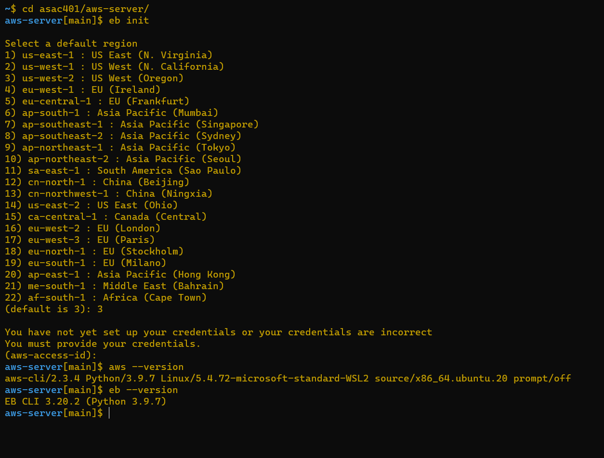

# aws-server

## Hassan Hamdan

- Repository URL: https://github.com/HassanHamdanDev/aws-server

- Branch Name: dev

- Description : **Deploy a simple Node.js server to EC2, using Elastic Beanstalk ( A simple API or Web Server)**

- PR : https://github.com/HassanHamdanDev/aws-server/pull/1

